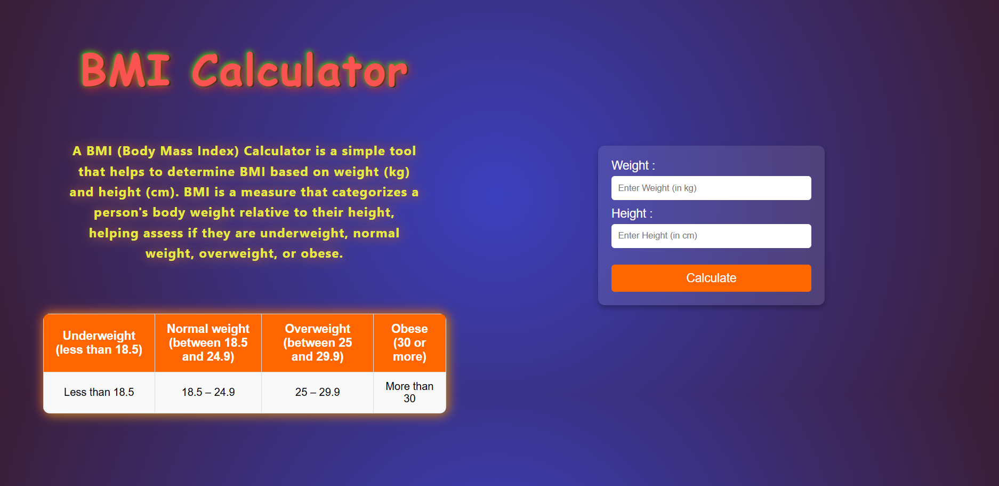

# FitLife-BMIChecker11376.github.io
<h1 style="{font-size:20px}">BMI Fit Checker</h1>
<h3>Author:<h4>Aditya Gupta</h4><h3></h3>

<h1>Overview</h1>

BMI Fit Checker is a simple and efficient tool for calculating Body Mass Index (BMI) and providing fitness recommendations based on the results. The project is designed to help users determine their health category and take necessary fitness actions.

<h1>Features</h1>
<ol type="circle">
  <li>BMI Calculation based on weight and height.</li>
  <li>Health Category Classification (Underweight, Normal, Overweight, Obese).</li>
  <li>Fitness & Diet Recommendations.</li>
  <li>User-Friendly Interface.</li>
</ol>
<h1>How to Use</h1>
<ol type="circle">
  <li>Enter your weight and height in the input fields.</li>
  <li>Click on the "Calculate" button.</li>
  <li>View your BMI score and category.</li>
</ol>

